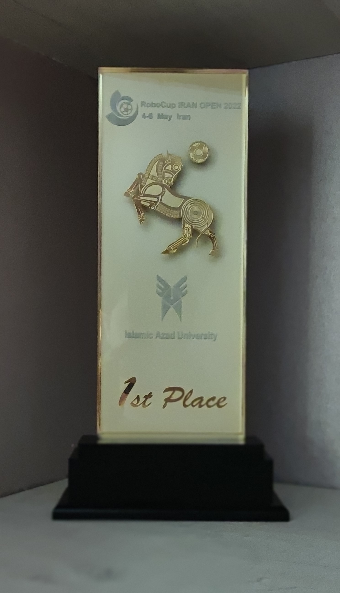
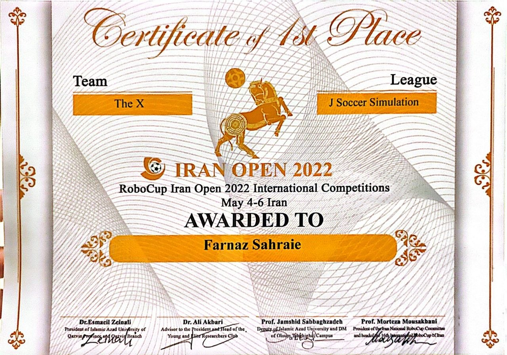
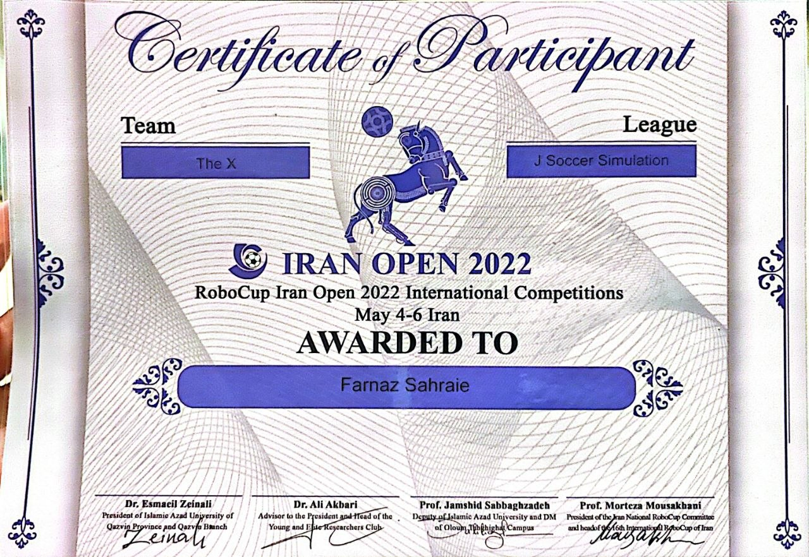
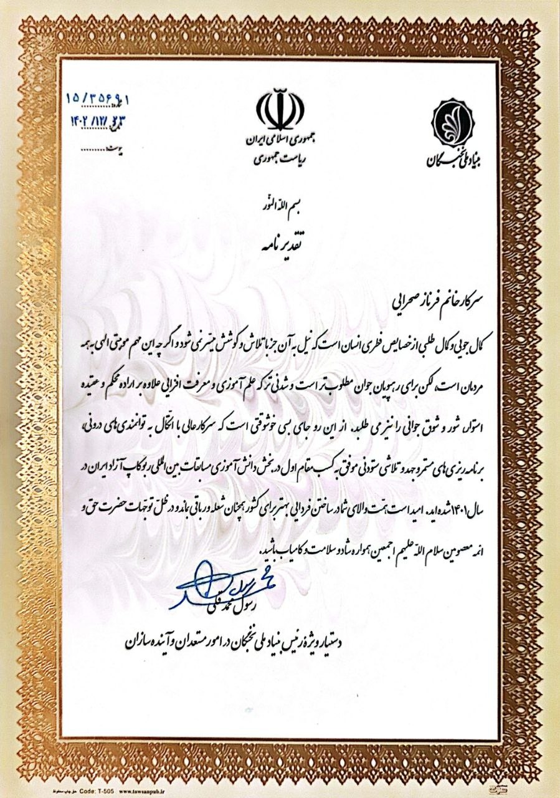
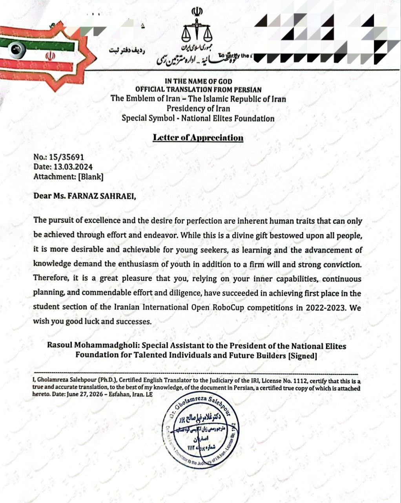
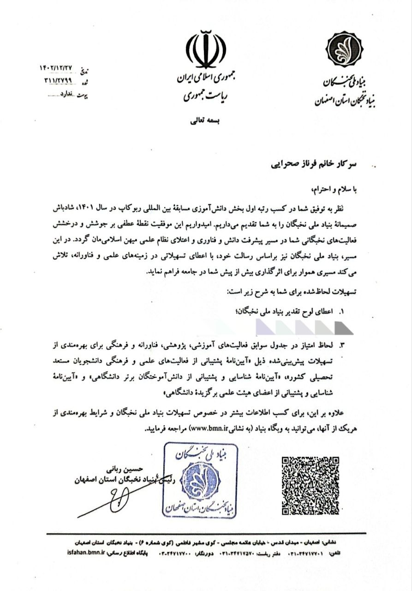
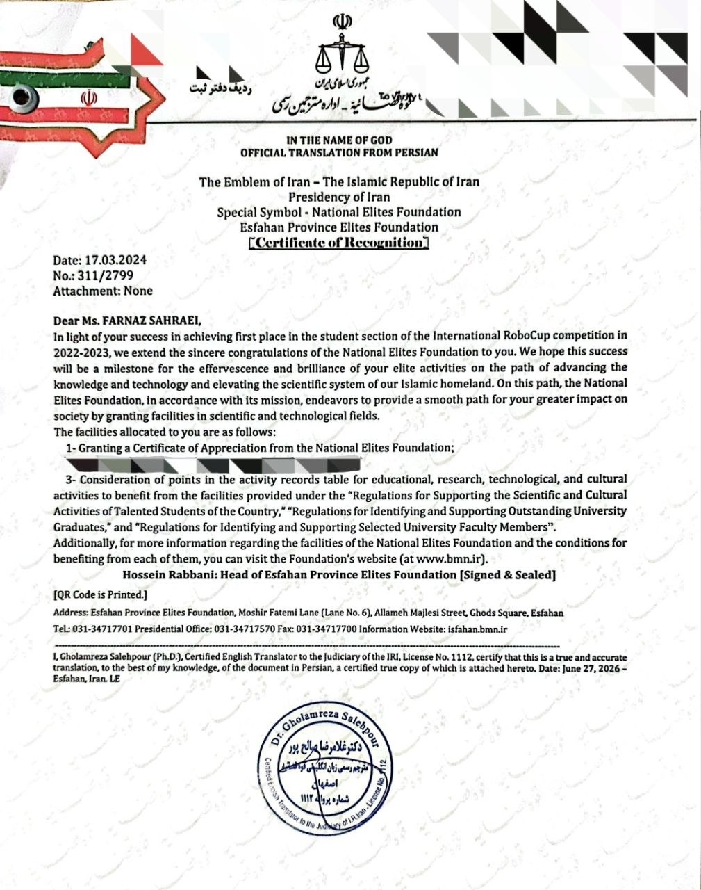

# Robot Soccer Simulation - RoboCup

## Overview

This project is an autonomous robot soccer simulation developed for participation in the Iran Open RoboCup Competition.

The system focuses on robot behavior simulation, team strategy, and autonomous decision-making in a virtual soccer environment.

The project was developed as part of a competitive robotics team and achieved first place in the Iran Open RoboCup Competition.

---

## Achievement

🏆 **1st Place – Iran Open RoboCup Competition (2022-2023)**

This project achieved the first rank in the Robot Soccer Simulation category at Iran Open RoboCup.

Following this achievement, I was recognized as a member of Iran's National Elites Foundation and received an official appreciation certificate from the special advisor to the president of the foundation.

---

## Project Information

- **Competition:** Iran Open RoboCup
- **Year:** 2022-2023
- **Category:** Robot Soccer Simulation
- **Project Type:** Autonomous Robotics Simulation

---

## Technologies

- Python 
- Robot Soccer Simulation Environment
- Artificial Intelligence
- Autonomous Agents
- Multi-Agent Systems
- Robotics Simulation

---

## Features

- Autonomous robot behavior simulation
- Team-based decision making
- Robot positioning and movement control
- Soccer strategy implementation
- Simulation-based testing and evaluation

---

## Demo Video

Watch the simulation:

[▶ Demo Video](videos/film1.mp4)

---

## Recognition

Achievement of this project resulted in:

- Membership in Iran's National Elites Foundation
- Receiving an official appreciation certificate from the special advisor to the president of the National Elites Foundation

---

## Author

Developed as a competitive robotics project for RoboCup participation.

The project represents practical experience in autonomous systems, robotics simulation, and intelligent agent development.
